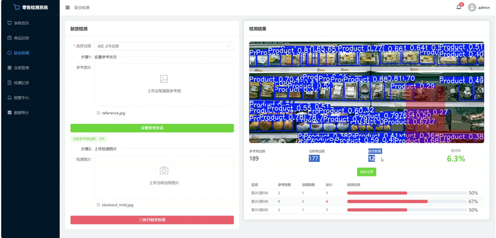
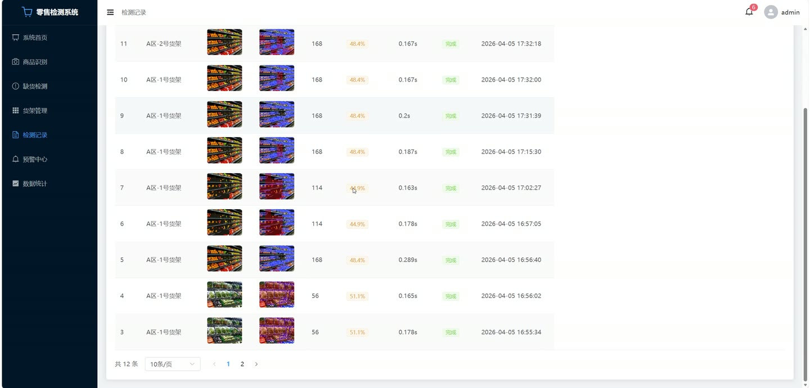
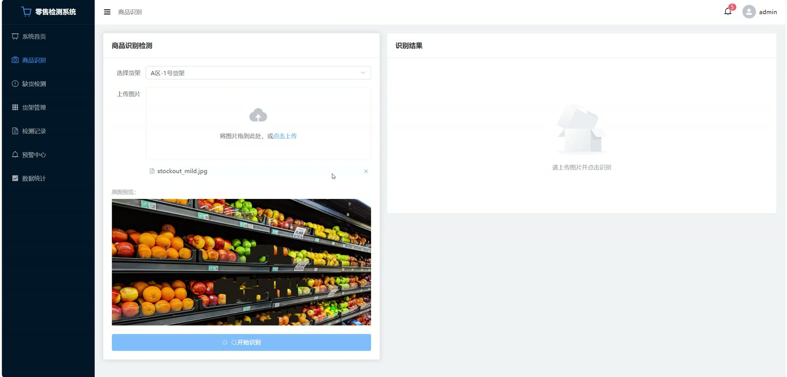
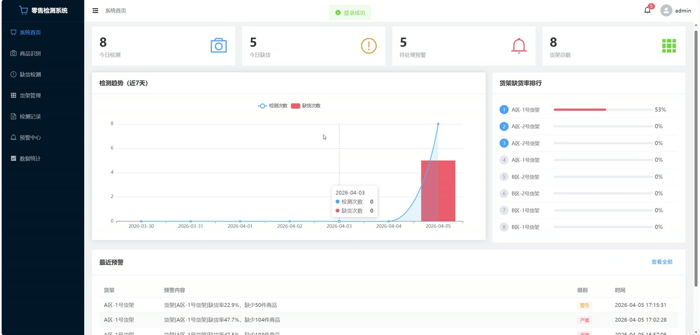

# (附文档)Python+YOLO+深度学习 基于YOLOv8的零售商品识别与缺货检测系统

**技术栈**：Python、Flask、PyTorch、YOLO、深度学习、Vue3、MySQL

### 系统简介

本系统是一套基于 YOLOv8 深度学习模型的零售商品识别与缺货检测平台，采用前后端分离架构。后端基于 Flask 提供 RESTful 接口，前端使用 Vue3 + Element Plus 构建可视化管理界面，通过 PyTorch 加载 YOLOv8 模型完成商品目标检测。系统区分管理员与操作员两类角色，覆盖商品识别、缺货检测、货架管理、预警中心与数据统计等业务场景。
 
### 核心功能
 
### 管理员端

 
- 账号登录：输入用户名与密码进行 JWT 鉴权登录，登录成功后跳转系统首页，未登录访问自动重定向至登录页。 
- 系统首页概览：展示今日检测次数、今日缺货次数、待处理预警数、货架总数四项核心指标卡片。 
- 检测趋势图：以折线图与柱状图组合展示近 7 天检测次数与缺货次数趋势。 
- 货架缺货率排行：按平均缺货率对货架进行排名，进度条按缺货率高低显示红/橙/绿三色。 
- 最近预警查看：在首页直接查看最近 5 条未读预警，支持一键跳转预警中心。 
- 商品识别检测：选择货架、上传图片后调用检测接口，返回标注结果图、检测商品数、平均置信度与检测耗时。 
- 检测详情查看：以表格展示每个识别目标的类别、置信度进度条及边界框坐标（x1,y1,x2,y2）。 
- 缺货检测：先上传满载参考图设置参考状态，再上传当前货架图执行缺货检测，输出参考数、当前数、缺货数与缺货率。 
- 缺货区域明细：按行列展示每个区域的参考数量、当前数量、缺少数量及缺货比例进度条。 
- 预警级别判定：根据缺货率自动判定正常、预警、严重三档，缺货率超过 15% 触发预警、超过 30% 触发严重预警。 
- 预警中心管理：按全部/未读/已读筛选预警列表，展示货架、类型、级别、内容、状态与时间，支持单条已读与全部已读。 
- 检测记录管理：按货架筛选检测记录，查看原图与结果图缩略图、商品数、平均置信度、耗时与状态，支持分页与每页条数切换。 
- 货架管理：新增、编辑、删除货架，维护货架名称、位置、商品位数与参考图片。 
- 数据统计：查看总检测次数、总缺货记录、平均置信度、平均检测耗时四项汇总指标。 
- 多维图表分析：支持近 7 天/近 30 天切换查看检测趋势、缺货趋势、平均置信度趋势与货架缺货率横向排行。 
- 修改密码：通过认证接口提交原密码与新密码完成账号密码变更。
 
### 操作员端

 
- 账号登录：使用操作员账号登录系统，角色字段区分 admin 与 operator。 
- 商品识别：上传货架图片并可选关联货架，触发 YOLOv8 模型推理并返回识别结果。 
- 缺货检测：选择货架后上传参考图与当前图，执行缺货比对并查看缺货区域列表。 
- 检测记录查询：按货架筛选并分页浏览历史检测记录，查看原图、结果图与置信度标签。 
- 预警查看：查看预警列表与未读数量，对预警执行标记已读操作。 
- 数据统计查看：浏览首页概览卡片与统计页图表，掌握货架缺货率排行情况。 
- 货架信息查看：在识别与缺货检测页面下拉选择已有货架，读取货架商品位数作为参考数量。
 
### 技术栈

 后端框架Python + Flask 深度学习框架PyTorch + Ultralytics YOLOv8 ORMFlask-SQLAlchemy 权限认证Flask-JWT-Extended + Werkzeug 密码哈希 跨域处理Flask-CORS 前端框架Vue3 + Element Plus 状态管理Pinia 前端路由Vue Router 4 图表库ECharts + vue-echarts 构建工具Vite 5 HTTP 客户端Axios 数据库MySQL（utf8mb4）
 
### 交付内容

 
- 后端完整源码 
- 前端完整源码 
- 数据库初始化脚本 
- 万字文档

## 界面展示

---

## 获取完整源码 + 万字文档

本仓库为项目介绍页。**完整前后端源码、数据库初始化脚本、万字项目文档**，请加微信 `kangkangcode`，或访问 [codekk.top](http://codekk.top) 获取。

可作课程设计 / 毕业设计参考，支持远程部署调试。